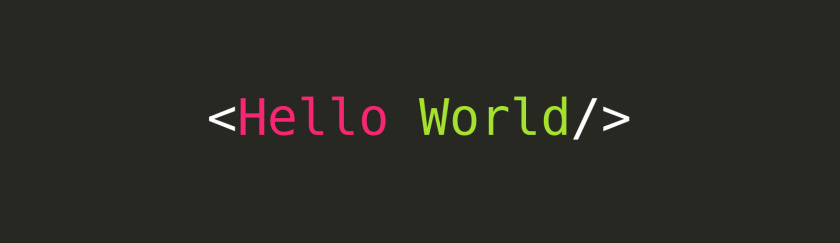

## Hi there 👋

<!--
**I-Higgins/I-Higgins** is a ✨ _special_ ✨ repository because its `README.md` (this file) appears on your GitHub profile.

Here are some ideas to get you started:

- 🔭 I’m currently working on ...
- 🌱 I’m currently learning ...
- 👯 I’m looking to collaborate on ...
- 🤔 I’m looking for help with ...
- 💬 Ask me about ...
- 📫 How to reach me: ...
- 😄 Pronouns: ...
- ⚡ Fun fact: ...
-->

<h1 align="center">Hi 👋, I'm Isaac Higgins</h1>
<h3 align="center">Unleashing Innovation Through Code: Software Engineer with Mobile Development expertise, making a difference with the click of a button.</h3>

I'm a versatile Software Engineer with a background in Embedded Software Engineering and a burgeoning passion for Front End Development after creating a custom SwiftUI iOS application for a local business, and developing cross-platform mobile apps using Flutter/Redux.
Adept at Agile methodologies and familiar with a diverse array of programming languages including Flutter/Redux, SwiftUI, SQL, C++, C#, HTML, CSS, and JavaScript, with a strong understanding of technical tools such as Git, Xcode, Azure DevOps and AWS.

---

- 🌱 I’m currently learning **Flutter**

- 💬 Ask me about **SwiftUI, Flutter**

- 📫 How to reach me **isaac_higgins_dev@icloud.com**, [LinkedIn]("https://linkedin.com/in/isaachiggins)

---

<h3 align="left">Core Skills:</h3>

* Flutter/Redux
* Swift - SwiftUI
* SQL
* C++
* C#
* HTML, CSS, JavaScript
* Python
* Git
* XCode
* Amazon Web Service (AWS)
* Unit + Automated Testing
* Cloud Infrastructure (AWS + Azure)
* Docker

---

<h3 align="left">Languages and Tools:</h3>

               

 

&nbsp;

---

